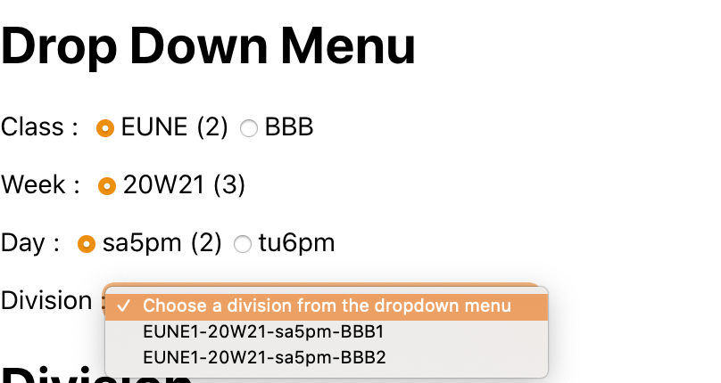

## ESDL Placement Tool Project

### How to run the project locally

- Clone this repository to your local terminal
- You will need to have node package manager installed for the next steps
- Once cloned, go into directory cloned and run `npm install`
  - Make sure you are in the parent directory
- Once npm has installed all the packages, run `npm start`
  - This command will start the React App and automatically start it on port 3000.
- Once you started React, it should send you to your local browser and open [http://localhost:3000](http://localhost:3000)

You should now view the project as it is at the moment. 

### Updates

#### 5/27
Got a README.md updated with instructions to clone and start app locally

#### 5/28
Got a menu of selections showing up after a loop around the JSON object provided. The drop down menu also uses a filter function to get the corresponding divisions to show by selections made.

Eventually this app is going to be hosted online and I will provide a link to view it there instead of cloning it locally
